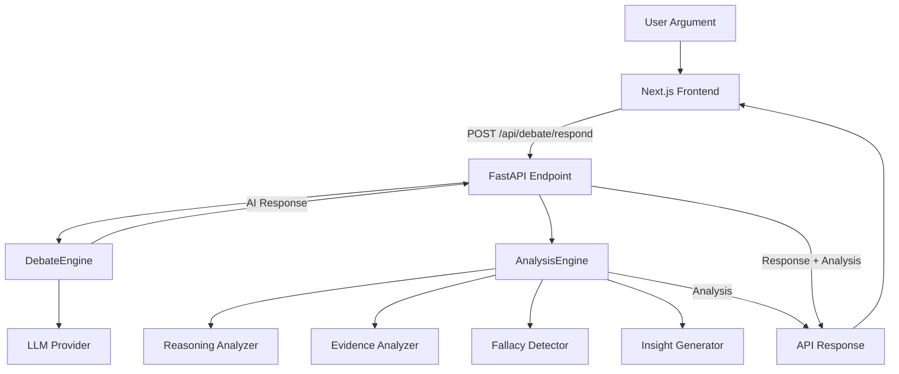

# DebateArena

An AI-powered debate coaching platform where users challenge intelligent opponents across structured multi-round debates — with real-time reasoning analysis, fallacy detection, and coaching insights.

DebateArena is not a chatbot. It is a debate training environment that evaluates the quality of your arguments, not just their content.

## Key Features

- **AI-Powered Debate Coaching** — each response is analyzed for reasoning quality, evidence use, and logical soundness
- **Multiple Debate Personas** — Socrates, The Prosecutor, The Philosopher, Devil's Advocate — each with unique debate styles
- **Structured Multi-Round Debates** — 5 rounds: Opening Arguments → Rebuttal → Counter-Rebuttal → Final Challenge → Closing Statements
- **Semantic Reasoning Analysis** — sentence embeddings evaluate argument structure beyond keyword matching
- **Evidence Quality Scoring** — detects statistics, citations, examples, and named entities
- **Fallacy Detection** — identifies Hasty Generalization, False Dilemma, Straw Man, Appeal to Authority, Slippery Slope, Circular Reasoning
- **Coaching Insights** — per-round strengths, improvements, and one-line coaching takeaways
- **Hugging Face Integration** — `sentence-transformers/all-MiniLM-L6-v2` for semantic feature extraction
- **Modular AI Architecture** — provider-agnostic LLM client, pluggable analyzers via dependency injection
- **FastAPI Backend** — async Python API with structured logging
- **Next.js Frontend** — React 19, TypeScript, Tailwind CSS, Framer Motion

## Architecture



## AI Pipeline

```
User Argument
    ↓
Debate Engine (prompt construction + LLM call)
    ↓
LLM Response (persona-styled debate text)
    ↓
Feature Extraction (structural, reasoning, evidence, language, semantic)
    ↓
Reasoning Analysis (weighted multi-signal scoring)
    ↓
Evidence Analysis (specificity + citation detection)
    ↓
Fallacy Detection (6 fallacy types, confidence-scored)
    ↓
Insight Generation (strengths, improvements, coaching takeaway)
    ↓
API Response (debate text + full analysis)
    ↓
Frontend (live rendering)
```

## Technology Stack

### Frontend

| Technology | Purpose |
|------------|---------|
| Next.js 16 | React framework |
| React 19 | UI library |
| TypeScript | Type safety |
| Tailwind CSS 4 | Styling |
| Framer Motion | Animations |
| Lucide React | Icons |

### Backend

| Technology | Purpose |
|------------|---------|
| FastAPI | Async Python API |
| Pydantic | Data validation |
| Pydantic Settings | Environment configuration |
| Uvicorn | ASGI server |
| httpx | Async HTTP client |

### AI / ML

| Technology | Purpose |
|------------|---------|
| Sentence Transformers | Embedding model |
| all-MiniLM-L6-v2 | Semantic feature extraction |
| Hugging Face Hub | Model hosting |
| Provider-agnostic LLM client | OpenAI, OpenRouter, Groq, Together, DeepSeek |

## Project Structure

```
DebateArena/
├── backend/
│   ├── main.py                    # FastAPI app entry point
│   ├── requirements.txt           # Python dependencies
│   ├── .env.example               # Environment variables template
│   ├── ai/
│   │   ├── api.py                 # Debate endpoint + response models
│   │   ├── config.py              # Centralized settings (pydantic-settings)
│   │   ├── debate_engine.py       # LLM orchestration
│   │   ├── enums.py               # Persona, Difficulty, DebateSide enums
│   │   ├── llm_client.py          # Provider-agnostic LLM abstraction
│   │   ├── models.py              # ConversationTurn model
│   │   ├── persona_manager.py     # Persona configs + system prompts
│   │   ├── prompt_builder.py      # Section-based prompt assembly
│   │   ├── response_parser.py     # JSON response parsing
│   │   └── prompts/
│   │       ├── __init__.py        # Prompt registry
│   │       ├── base.py            # Shared debate rules
│   │       ├── socrates.py        # Socrates prompt (v1.0)
│   │       ├── prosecutor.py      # Prosecutor prompt (v1.0)
│   │       ├── philosopher.py     # Philosopher prompt (v1.0)
│   │       └── devils_advocate.py # Devil's Advocate prompt (v1.0)
│   └── analysis/
│       ├── __init__.py            # AnalysisEngine export
│       ├── analysis_engine.py     # Orchestrator (DI'd analyzers)
│       ├── features.py            # Multi-signal feature extraction
│       ├── schemas.py             # Observation, ReasoningScore, AnalysisResult
│       ├── reasoning_analyzer.py  # ABC + heuristic fallback
│       ├── semantic_reasoning_analyzer.py  # MiniLM-powered scoring
│       ├── evidence_analyzer.py   # ABC + heuristic fallback
│       ├── insight_generator.py   # ABC + rule-based synthesis
│       ├── hf_reasoning_analyzer.py  # Backward-compat alias
│       ├── clients/
│       │   └── huggingface_client.py  # Model loading, caching, inference
│       └── fallacies/
│           ├── __init__.py
│           ├── schemas.py         # Fallacy model + FallacyType enum
│           ├── taxonomy.py        # Fallacy definitions
│           ├── heuristics.py      # Multi-signal detection functions
│           └── detector.py        # ABC + heuristic implementation
├── frontend/
│   ├── package.json
│   ├── .env.example               # Frontend env template
│   └── src/
│       ├── app/
│       │   ├── layout.tsx         # Root layout + Inter font
│       │   ├── globals.css        # Dark theme + glass utilities
│       │   ├── page.tsx           # Landing page
│       │   ├── setup/page.tsx     # 4-step debate setup wizard
│       │   └── debate/page.tsx    # Debate orchestration (live API)
│       ├── components/
│       │   └── debate/
│       │       ├── ArgumentCard.tsx
│       │       ├── ArgumentComposer.tsx
│       │       ├── AnalysisPanel.tsx
│       │       ├── DebateHeader.tsx
│       │       ├── ObservationCard.tsx
│       │       ├── PropositionBar.tsx
│       │       └── ScoreRing.tsx
│       ├── constants/
│       │   └── personas.ts        # Frontend persona definitions
│       └── types/
│           └── index.ts           # All TypeScript types
```

## Installation

### Prerequisites

- Python 3.11+
- Node.js 18+

### Backend

```bash
cd backend

# Create virtual environment
python -m venv venv

# Activate it
# Windows:
venv\Scripts\activate
# macOS/Linux:
source venv/bin/activate

# Install dependencies
pip install -r requirements.txt

# Configure environment
cp .env.example .env
# Edit .env with your LLM provider settings

# Start the server
python main.py
```

The backend runs at `http://localhost:8000`.

### Frontend

```bash
cd frontend

# Install dependencies
npm install

# Configure environment
cp .env.example .env.local
# Edit .env.local if needed

# Start the dev server
npm run dev
```

The frontend runs at `http://localhost:3000`.

## Environment Variables

### Backend

| Variable | Default | Description |
|----------|---------|-------------|
| `LLM_PROVIDER` | `stub` | LLM provider: `stub`, `openai`, `openrouter`, `groq`, `together`, `deepseek` |
| `LLM_API_KEY` | | API key for the selected provider |
| `LLM_BASE_URL` | `https://api.openai.com/v1` | API base URL (override for OpenRouter, etc.) |
| `LLM_MODEL` | `gpt-4o-mini` | Model name to use |
| `LLM_TEMPERATURE` | `0.7` | Sampling temperature |
| `LLM_MAX_TOKENS` | `1024` | Max tokens per response |
| `LOG_LEVEL` | `INFO` | Python logging level |

### Frontend

| Variable | Default | Description |
|----------|---------|-------------|
| `NEXT_PUBLIC_API_URL` | `http://localhost:8000` | Backend API URL |

## API Endpoints

| Method | Path | Description |
|--------|------|-------------|
| `GET` | `/health` | Health check |
| `POST` | `/api/debate/respond` | Generate AI debate response with analysis |

### POST /api/debate/respond

**Request:**
```json
{
  "persona_id": "socrates",
  "topic": "AI will replace most white-collar jobs",
  "side": "for",
  "difficulty": "scholar",
  "round_number": 1,
  "history": [],
  "user_argument": "Your argument text here."
}
```

**Response:**
```json
{
  "response": "AI debate response text...",
  "thinking_style": "analytical questioning",
  "next_focus": "demand evidence for the core claim",
  "tone": "measured but challenging",
  "persona_id": "socrates",
  "round_number": 1,
  "parse_success": true,
  "analysis": {
    "scores": {
      "overall": 42,
      "logic": 45,
      "evidence": 30,
      "coherence": 50,
      "persuasion": 40
    },
    "observations": [
      {
        "type": "suggestion",
        "title": "Evidence",
        "description": "No evidence markers detected."
      }
    ],
    "fallacies": [
      {
        "type": "hasty_generalization",
        "name": "Hasty Generalization",
        "confidence": 0.68,
        "explanation": "Uses broad quantifiers without evidence.",
        "evidence": "most white-collar jobs"
      }
    ],
    "strengths": ["Clear logical structure."],
    "improvements": ["Ground claims in specific evidence."],
    "insight": "Solid foundation — tighten your evidence."
  }
}
```

## Screenshots

### Landing Page


### Debate Setup


### Debate Screen


### Analysis Panel


## Backend Module Reference

### `ai/` — Debate Engine

| Module | Purpose |
|--------|---------|
| `debate_engine.py` | Stateless orchestrator: builds prompts, calls LLM, parses responses |
| `llm_client.py` | Abstract `LLMClient` + `OpenAICompatibleClient` + `StubClient` |
| `prompt_builder.py` | Section-based prompt assembly (system prompt → context → difficulty → rules) |
| `persona_manager.py` | Persona configs loaded from versioned prompt modules |
| `prompts/` | One file per persona, each exporting `SYSTEM_PROMPT` + `PROMPT_VERSION` |
| `response_parser.py` | 3-level JSON fallback parser |
| `config.py` | Centralized settings via pydantic-settings |
| `enums.py` | `Persona`, `Difficulty`, `DebateSide`, `Tone` enums |

### `analysis/` — Analysis Engine

| Module | Purpose |
|--------|---------|
| `analysis_engine.py` | Orchestrates reasoning → evidence → fallacy → insight pipeline |
| `features.py` | Multi-signal feature extraction (structural, reasoning, evidence, language, semantic) |
| `semantic_reasoning_analyzer.py` | MiniLM embeddings → weighted scoring |
| `reasoning_analyzer.py` | `ReasoningAnalyzer` ABC + `HeuristicReasoningAnalyzer` fallback |
| `evidence_analyzer.py` | `EvidenceAnalyzer` ABC + `HeuristicEvidenceAnalyzer` fallback |
| `insight_generator.py` | `InsightGenerator` ABC + rule-based synthesis |
| `schemas.py` | `Observation`, `ReasoningScore`, `AnalysisResult` models |
| `clients/huggingface_client.py` | Model loading, caching, embedding + cosine similarity |
| `fallacies/` | `FallacyDetector` ABC, 6-fallacy taxonomy, multi-signal heuristics |

## Future Roadmap

- [ ] Multi-turn conversation memory across debate rounds
- [ ] Adaptive persona difficulty based on user performance
- [ ] ML-powered fallacy classifiers (BERT, DeBERTa, RoBERTa)
- [ ] Improved evidence models with claim verification
- [ ] Debate history and replay
- [ ] Analytics dashboard with performance trends
- [ ] Real-time debate scoring during live sessions
- [ ] Custom persona creation
- [ ] Export debate transcripts and analysis reports

## License

MIT License. See [LICENSE](LICENSE) for details.
